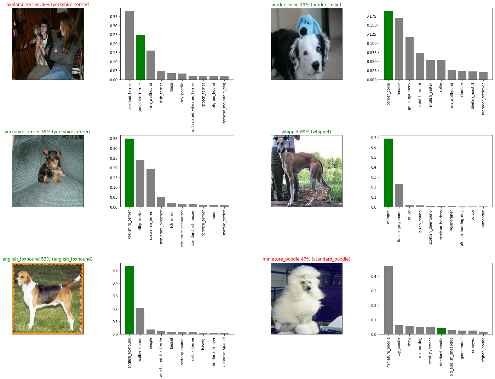

# 🐶 End-to-End Multi-class Dog Breed Classification
A complete end to end solution for a multiclass classification problem of identifying the breed of dogs.

## This notebook builds an end-to-end multi-class image classifier using TensorFlow 2.0 and TensorFlow Hub.

## 1. Problem

Identifying the breed of a dog given an image of a dog.

## 2. Data

The data we're using is from Kaggle's dog breed identification competition.
https://www.kaggle.com/competitions/dog-breed-identification/data

## 3. Evaluation

The evaluation is a file with prediction probabilities for each dog breed of ech test image.
https://www.kaggle.com/competitions/dog-breed-identification/overview/evaluation

## 4. Features

Some information about the data:
* We're dealing with images (unstructured data) so it's probably best we use deep learning/transfer learning.
* There are 120 breeds of dogs (this means there are 120 different classes).
* There are around 10,000+ images in the training set (labelled)
* There are around 10,000+ images in test set (unlabelled)

## Examples:

## License
This notebook is created by Abhishek Gautam and is licensed under the MIT license.
